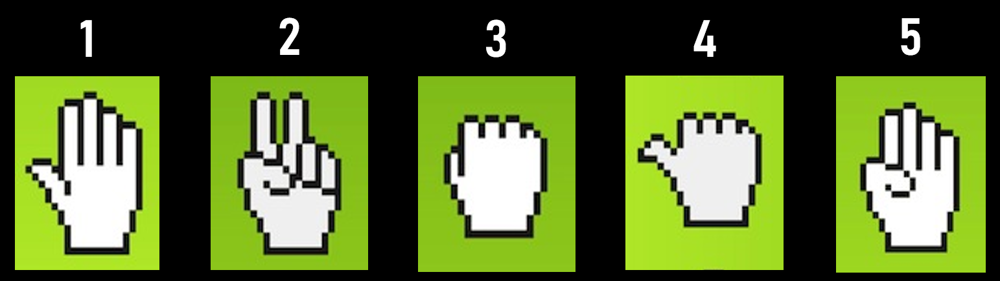

# Drawing tool by hand gestures

 The project made by `Team A : KEIO University Project by KEIO University (KEIO AIC) x NVIDIA collaboration`. <br>

 We implemented a drawing tool by hand gestures. In this application, Jetson estimates hand poses, then classifies hand gestures from the hand poses. <br>

We use [TRT Pose Hand](https://github.com/NVIDIA-AI-IOT/trt_pose_hand) to estimate hand poses. TRT Pose Hand is a deep learning model of hand pose estimation which can work at 15 ~ 20 FPS on Jetson Nano 2GB model.<br>

 To classify hand gestures we use a SVM model which is the same codes as TRT Pose Hand. However, to classify more precisely we train the SVM model from scratch.
We use 6000 images (1200 images for each 5 classes) for train dataset. The model was able to classify hand poses with 95% accuracy in our environment. <br>

 Lastly, we use KLT feature tracker to draw smoother lines. TRT Pose Hand estimates hand poses from an image not a movie. That's why it sometimes drew angular lines because it didn't consider the relation between the previous image and the current image. KLT feature tracker, which is one of the image processing technology, can find points in the current image corresponding to the points in the previous image. 

## Working Example
<center>
<table align="center" border="1">
<tr>
<td></td>
<td></td>
<td></td>
</tr>
<tr>
<td>Pen and change size</td>
<td>Eraser</td>
<td>Zoom</td>
</tr>
</table>
</center>
<br>

## Gesture
<center>

</center>
<br>

1. None
1. Draw or Erase
1. change mode (pen or eraser) and choose size
1. zoom in
1. zoom out

## Requirement
- jetpack 4.5.1 for 2GB ( https://developer.nvidia.com/jetpack-sdk-451-archive )
- Jetson nano 2GB model (can work with any Jetson devices but we did not check)
- USB cable (MicroB to typeA)
- Web camera
- your PC which can run exe file

## Getting started (Jetson)
### How to make docker image and container
At first, you need to connect your web camera to your Jetson. <br>
After connecting, run the below commands:
```bash
$ git clone https://github.com/kosukess/AIC.git
$ cd AIC
$ sh docker/build.sh
$ sh docker/run.sh
```

### Install required libraries to docker container
After you start the docker container first time, you need to install requirements. 
```bash
$ sh environment/trt_pose_hand_env.sh
```

### Start docker container second time or after
```bash
$ sh docker/open.sh
```

## Getting started (your PC)
Download `client_computer/show_output.exe`

## Usage
**At first, you have to connect your Jetson to your PC.**<br>
### Jetson
After you start the docker container which has required libraries, you can run:
```bash
cd project
python3 main.py
```
`main.py` estimates your hand position and gesture class, and send them to your PC.<br>
Jetson begins sending data to your PC about 3 minutes after you execute `python3 main.py`.

### your PC
Run `client_computer/show_output.exe`.<br>
After your PC receives data from Jetson, a whiteboard which you can draw shows on your PC.